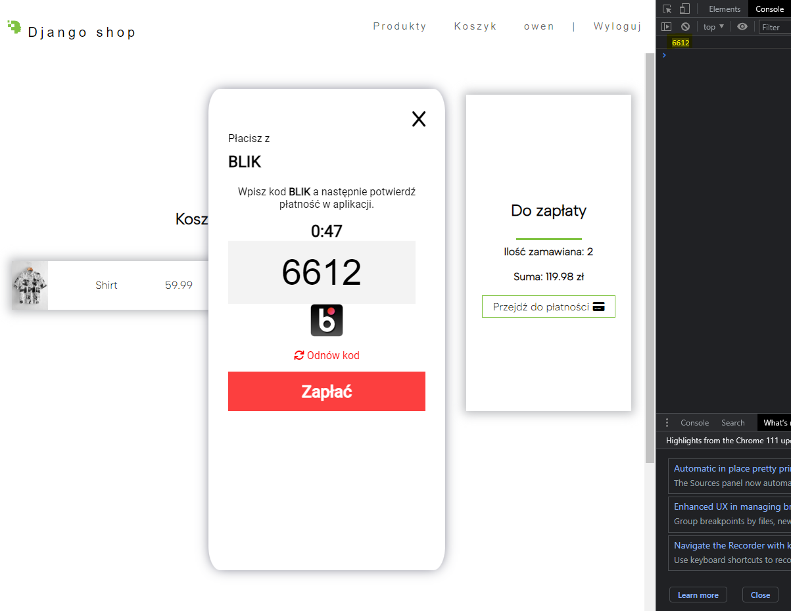

# Setup

> ### Upgrade pip to the latest version:
```python
python -m pip install --user --upgrade pip
```
<br>

> ### Install virtual environment:
```python
python -m pip install --user virtualenv
python -m venv %venv_name% #creates folder in your current directory
```
<br>

> ### Activate virtual environment:
**bash**
```bash
source %venv_name%/bin/activate
```
>##### Windows
```powershell
set-executionpolicy remotesigned
```
```python
python scripts/windows_path.py
```
```powershell
.\venv-windows\Scripts\Activate.ps1
```
<br>

> ### Install dependencies:
```python
pip install -r requirements.txt
```

<br>

### Creating admin account
```bash
python manage.py createsuperuser
```
### Local server
```bash
python manage.py runserver
```

# Example


